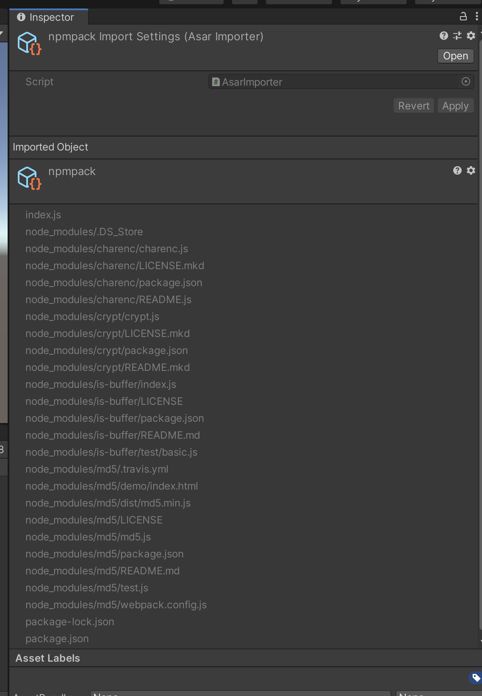
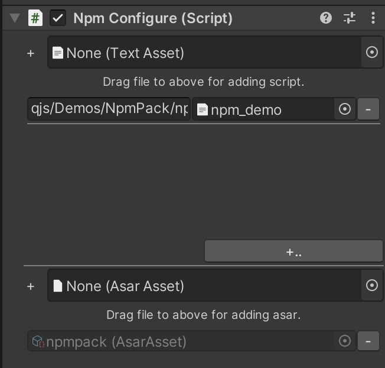

# unity-qjs
This is a quickjs plugin for unity (BETA)

# Fetures

- Suport any C# class and dynamic register.

.cs
```c#
quickJS.RegisterClass<Vector3>();
```
.js
```js
const Vector3 = unity('UnityEngine.Vector3');
```

- Support asar file.

asar is a archive file type used in electron. [asar project](https://github.com/electron/asar)



- Support npm package

Your can import npm project via asar file.



Then just `require` your npm package.

```js
const md5 = require('md5');
console.log(md5('hello'));
```

- Support `require` and `import` both

Also, `module.exports = A` is same as `export default A`.

- `await` coroutine

```js
async Start() {
    console.log("before coroutine");
    await new WaitForSeconds(3);
    console.log("after coroutine");
}
```

- `c# delegate` convert to `js function` and back

```js
let thread = new Thread(function () {
  console.log("In " + Thread.CurrentThread.Name);
});
thread.Name = "SubThread";
thread.Start();
```

ps: This thread demo is not real multi-thread, because js engine will lock the thread.

- Support `Worker`

Just use `Worker` for multi-thread, like in browser.

- Customer type convert

Your can implment a `toUnity` function for support convert to C# object. 

```js
const Vector3 = unity('UnityEngine.Vector3');
vec3.prototype.toUnity = ()=>new Vector3(...this.m);
```

Then, you can pass `vec3` to C#.

```js
this.transform.position = vec3(1,0);
```

- Performance

About 2x faster than xLua on Mac OSX. Tested call JS from C# and JS caculate.

